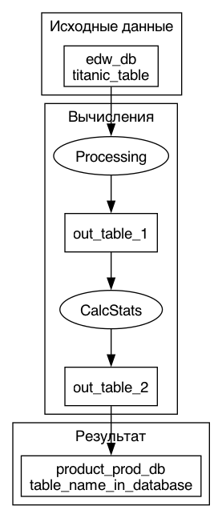

# Название пайплана

Общее описание всего пайплайна вычислений

## Модуль состоит из последовательного выполнения следующих шагов:
* **SomeStep** (Название шага):

    Описание вычислений класса в формате Markdown

    *Исходные таблицы:*

	* input_table_1 (edw_db.sales_table) (Таблица для теста)

    *Выходные таблицы:*

	* out_table_1 (Таблица после теста)

* **AnotherStep** (Шаг, описание которого осталось за скобками):

    Делает то же, что и предыдущий:
    * удавивает цену, записывает результат в колонку `double_price`

    *Исходные таблицы:*

	* out_table_1 (Результат вычислений шага SomeStep) (Таблица для теста)

    *Выходные таблицы:*

	* out_table_2 (Таблица после теста)

## Результатом выполнения алгоритма являются следующие таблицы:
* out_table_2 (Результат вычислений шага AnotherStep) (Финальная таблица):

<table>
  <thead>
  <tr>
    <th>Название колонки</th><th>Формат</th>
  </tr>
  </thead>
  <tbody>
  <tr>
    <td>plu</td><td>string</td>
  </tr>
  <tr>
    <td>double_price</td><td>double</td>
  </tr>
  </tbody>
</table>

